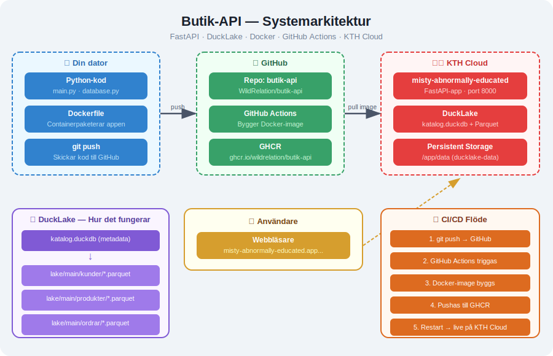

# Butik-API

En molndriftsatt webbapplikation byggd med **Python/FastAPI** och **DuckLake** som körs på **KTH Cloud**.

## Arkitektur



## Teknikstack

| Komponent | Teknologi |
|-----------|-----------|
| Webbramverk | FastAPI (Python) |
| Databas | DuckLake (Parquet-filer) |
| Container | Docker |
| CI/CD | GitHub Actions → GHCR |
| Hosting | KTH Cloud (Kubernetes) |
| Lagring | Persistent volume (ducklake-data) |

## Funktioner

- Visa, lägga till och ta bort **kunder**, **produkter** och **ordrar**
- Data lagras som **Parquet-filer** via DuckLake
- **Time travel** — varje ändring skapar en snapshot
- Automatisk deployment via GitHub Actions

## Köra lokalt

```bash
source venv/bin/activate
export CATALOG_PATH=./data/katalog.duckdb
export DATA_PATH=./data/lake/
uvicorn main:app --reload
```

## Köra med Docker

```bash
docker compose up --build
```

## Live

https://misty-abnormally-educated.app.cloud.cbh.kth.se
